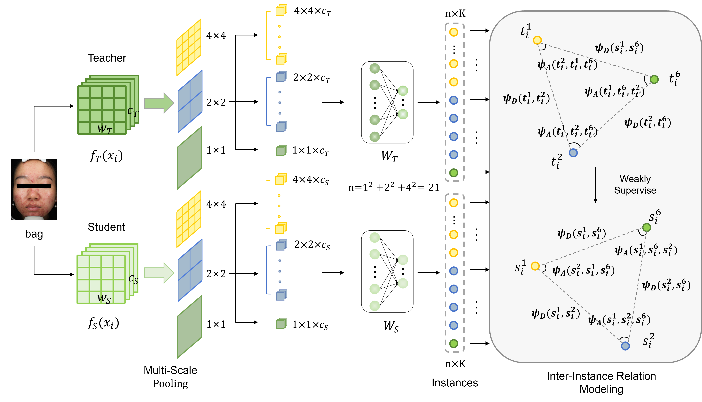

# LINK
Official code for the paper “LINK: Learning Inter-Region Relation via Knowledge Distillation for Weakly Supervised Acne Severity Grading”

# Introduction
## Framework

## Installation

- Python 3.8  
- PyTorch 1.9.0  
- torchvision 0.10.0
- cuda 11.1

## Training on ACNE04：
- Fetch the pretrained teacher models by:
```
python train_teacher.py
```
- Train student models by:
```
python train_student_LINK_KD.py
```
